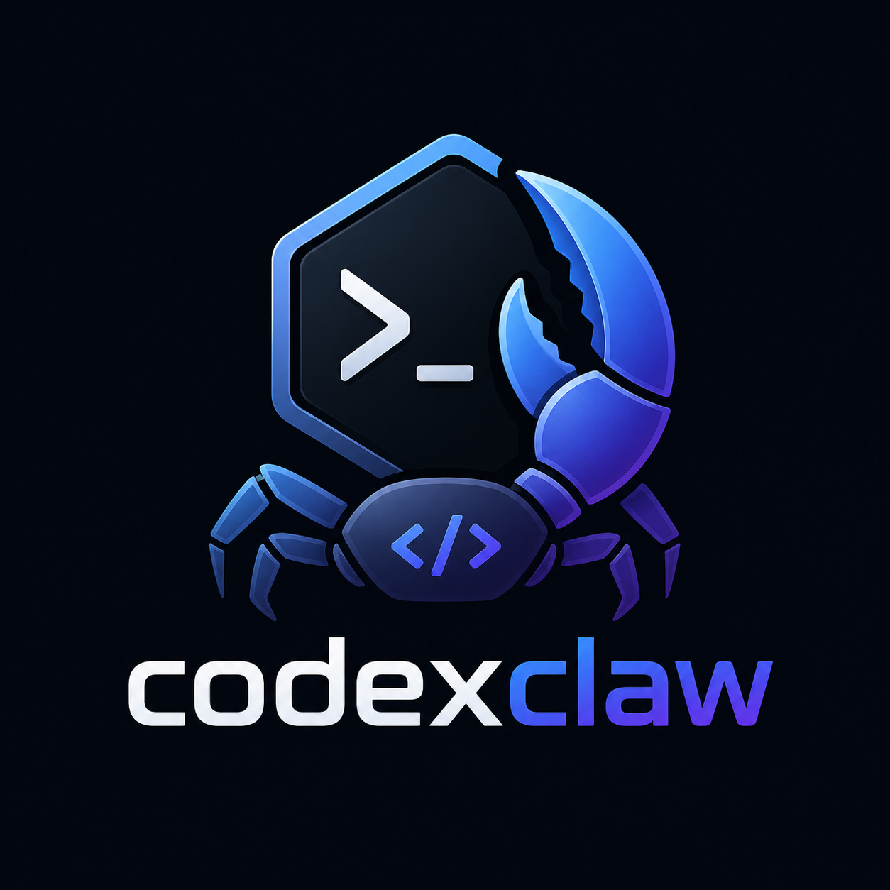

# codexclaw



codexclaw is a minimal host and client layer for `codex app-server`. It routes messages from channels such as a CLI, Telegram, or Discord into Codex threads and streams the results back.

codexclaw is an independent open-source client for Codex app-server. It is not affiliated with or endorsed by OpenAI.

Inspired by [nanoclaw](https://github.com/qwibitai/nanoclaw). The container-isolation and channel-adapter patterns originate there; codexclaw adapts them for the Codex ecosystem.

## Local CLI Runtime

Install dependencies with Bun, start a Codex app-server, then run the M1 CLI
runtime:

```sh
bun install
cp .env.example .env
bun run start:codex
bun run cli
```

Verify the pinned app-server schema before runtime work:

```bash
bun run schema:verify
```

Required environment:

- `CODEXCLAW_CODEX_WS`: Codex app-server WebSocket URL.
- `CODEXCLAW_CODEX_TOKEN_FILE`: file containing the bearer token used by the app-server. Defaults to `.codexclaw/codex.token`, which `bun run start:codex` creates automatically for local development.

The M1 CLI path uses the shared runtime router, SQLite pointer store, thread
manager, approval bridge, and one-active-turn queue that future Telegram and
Discord adapters build on. The older spike scripts remain available under
`bun run spike:*` for protocol diagnostics.

## Telegram Runtime

Telegram runs as a long-polling personal channel:

```bash
CODEXCLAW_TELEGRAM_BOT_TOKEN=123456:bot-token
CODEXCLAW_TELEGRAM_ALLOWED_USER_IDS=123456789
bun run telegram
```

Required Telegram environment:

- `CODEXCLAW_TELEGRAM_BOT_TOKEN`: bot token from BotFather.
- `CODEXCLAW_TELEGRAM_ALLOWED_USER_IDS`: comma-separated numeric Telegram user IDs.

Optional Telegram environment:

- `CODEXCLAW_TELEGRAM_POLLING_TIMEOUT_SECONDS`: long-poll timeout, default `30`.
- `CODEXCLAW_TELEGRAM_MODIFY_TIMEOUT_MS`: adapter reply collection timeout for Modify, default `600000`.
- `CODEXCLAW_TELEGRAM_DELTA_FLUSH_MS`: streaming coalescing window, default `750`.
- `CODEXCLAW_TELEGRAM_API_BASE_URL`: Bot API base URL for tests or self-hosting.
- `CODEXCLAW_TELEGRAM_ALLOW_ALL_USERS_FOR_LOCAL_DEV=true`: local-only escape hatch for an empty allowlist.

M2 Telegram supports private chats only. Webhook signing and rate-limit
hardening are out of scope for the long-polling path; callback data carries only
opaque adapter keys and action names.

codexclaw stores only its own routing data: thread pointers, labels, statuses,
pending approval mappings, schedules, and prefs placeholders. Codex rollout
storage remains the source of truth for conversation bodies, tool calls, diffs,
and approval histories.

See [docs/ROADMAP.md](docs/ROADMAP.md) for the PRD-based project roadmap.
